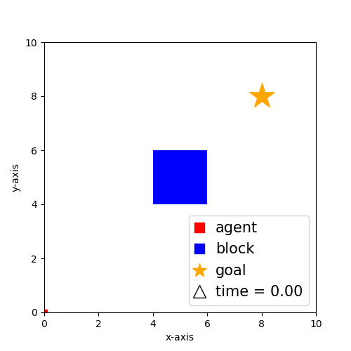

# SCIPPlan

SCIPPlan [1,2] is a SCIP-based [3] hybrid planner for domains with i) mixed (i.e., real and/or discrete valued) state and action spaces, ii) nonlinear state transitions that are functions of time, and iii) general reward functions. SCIPPlan iteratively i) finds violated constraints (i.e., zero-crossings) by simulating the state transitions, and ii) adds the violated (symbolic) constraints back to its underlying optimization model, until a valid plan is found.

## Example Domain: Navigation

Figure 1: Visualization of a plan generated by SCIPPlan [1,2] for an example navigation domain where the red square represents the agent, the blue square represents the block, the gold star represents the goal location and the delta represents time. The agent can control its acceleration and the duration of its control input to modify its speed and location in order to navigate in a two-dimensional maze. The goal of the domain is to find a path for the agent with minimum makespan such that the agent reaches its the goal without colliding with the obstacle. Note that SCIPPlan does not linearize or discretize the domain to find a valid plan.

## Dependencies

i) Solver: SCIP (the current implementation uses the python interface to the SCIP solver, i.e., PySCIPOpt [4]).

## Running SCIPPlan

python scipplan.py -d domain -i instance -h horizon -e epsilon -g gap

Example: python scipplan.py -d navigation -i 10x10 -h 2 -e 0.1

If horizon is specified, SCIPPlan attempts to find a plan over that horizon. Otherwise, horizon is set to 1 and is incremented until a valid plan is found.

Default value for epsilon (i.e., if not provided) is 0.01.

Default value for optimality gap (i.e., if not provided) is 0.001 (i.e., 0.1%).

## Citation

If you are using SCIPPlan, please cite the papers [1,2] and the underlying SCIP solver [3].

## References
[1] Buser Say and Scott Sanner. [Metric Nonlinear Hybrid Planning with Constraint Generation](http://icaps18.icaps-conference.org/fileadmin/alg/conferences/icaps18/workshops/workshop06/docs/proceedings.pdf#page=23). In PlanSOpt, pages 19-25, 2018.

[2] Buser Say and Scott Sanner. [Metric Hybrid Factored Planning in Nonlinear Domains with Constraint Generation](https://link.springer.com/chapter/10.1007/978-3-030-19212-9_33). In CPAIOR, pages 502-518, 2019.

[3] [SCIP](https://www.scipopt.org/)

[4] [PySCIPOpt](https://github.com/SCIP-Interfaces/PySCIPOpt)
